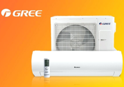

# Gree, Cooper&Hunter HVAC

This app adds support of Gree compatible HVACs to Homey.



## Supported devices
* Gree Wi-Fi HVACs
* Cooper&Hunter Wi-Fi HVACs
* Daitsu Wi-Fi HVACs

*If you found that your HVAC works and brand is not mentioned above please create an issue to add this brand as compatible*

## Links
[Gree app in Homey Apps](https://apps.athom.com/app/com.gree)

[Gree app GitHub repository](https://github.com/aivus/com.gree)

## Configuring HVAC WiFi

HVAC must be connected to the same WiFi network where is Homey.
It can be done using standard application, for example [EWPE Smart](https://play.google.com/store/apps/details?id=com.gree.ewpesmart) or manually using CLI:

1. Make sure your HVAC is running in AP mode. You can reset the WiFi config by pressing MODE +WIFI (or MODE + TURBO) on the AC remote for 5s.
2. Connect with the AP wifi network (the SSID name should be a 8-character alfanumeric, e.g. "u34k5l166").
3. Run the following in your UNIX terminal:

```shell
echo -n "{\"psw\": \"YOUR_WIFI_PASSWORD\",\"ssid\": \"YOUR_WIFI_SSID\",\"t\": \"wlan\"}" | nc -cu 192.168.1.1 7000
````

## This app is tested using next devices:
* Cooper&Hunter Alpha CH-S18FTXE (Wi-Fi)

## Changelog
v0.1.0
* First version of app.
* Allows to turn on and off
* Change HVAC modes
* Control temperature